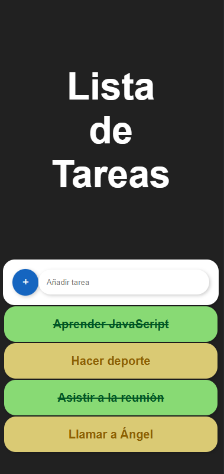
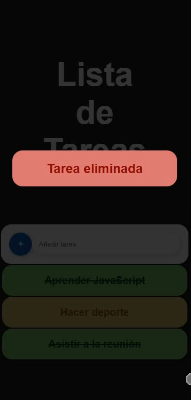
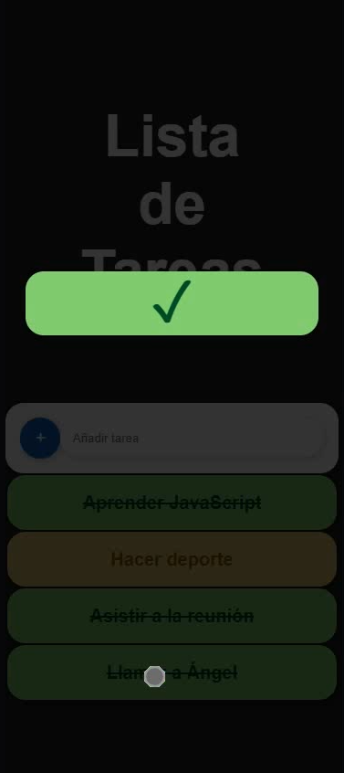
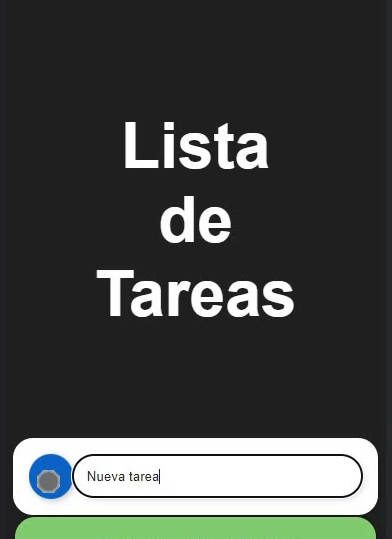

### Ángel José Mancha Núñez
# HTTP To-do List Description

This application serves as a to-do list where users interact with it trough gestures.

 

- In order to remove a task, just perform a **quick swipe** to the right.

 

- To mark a task as completed, **press and hold** the corresponding task.

 

- To unmark a task as completed, also **press and hold** the same task. 
- In order to add new tasks, just **type** them and it will be added to the list.

 

The technology that relies behind is based on a **http server** which handles the **json** in which all the tasks are stored and updates it according to the petitions from the user.

# Deployment
```bash
node ./index.js
  ```
